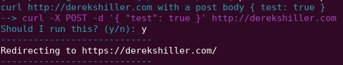

Plain English bash via OpenAI's API

Note, you need an API key for OpenAI's GPT3 to use this.

Add the following to your bash profile:
```
export OPENAI_API_KEY=your-key-here
alias please="python3 ~/path/to/please"
```

Usage:

```
please list all my files by file size
please sed replace 'jacket' with 'coat' in file.txt
```




